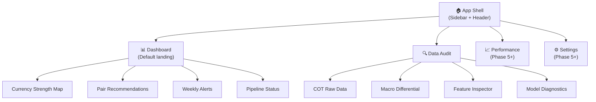
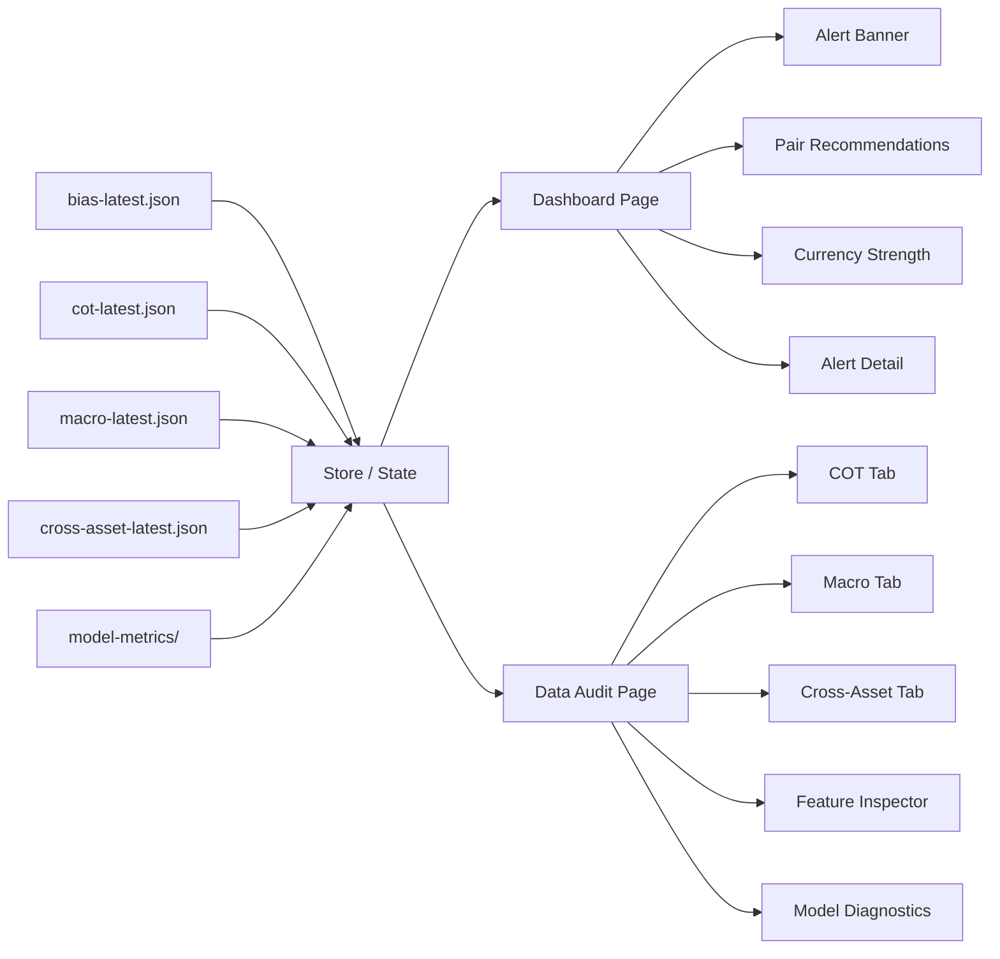

# FX Bias AI — UI/UX Design Document

**Version:** 1.0  
**Ngày:** 2026-03-19  
**RPD Reference:** v2.1  
**Trạng thái:** Draft — chờ review  

---

## 1. Bối Cảnh & Mục Tiêu Thiết Kế

### 1.1 Người Dùng

| Thuộc tính | Chi tiết |
|---|---|
| **Persona** | Solo FX Trader — chủ sở hữu hệ thống |
| **Workflow** | Mỗi thứ Bảy sáng: mở dashboard → đọc bias → double-check data → quyết định tuần tới |
| **Thiết bị chính** | Desktop (1920×1080) — laptop khi di chuyển |
| **Thiết bị phụ** | Mobile (nhận Telegram alert, glance nhanh) |
| **Thời gian review** | 5–15 phút tập trung, không muốn lướt nhiều page |
| **Kỳ vọng** | Nhìn vào là **biết ngay** tuần tới nên trade gì, tránh gì |

### 1.2 Nguyên Tắc UX

| Nguyên tắc | Áp dụng |
|---|---|
| **Glanceable** | Thông tin quan trọng nhất visible trong 3 giây đầu tiên |
| **Trust through transparency** | Mỗi prediction hiển thị lý do — user tin vì hiểu, không phải vì đẹp |
| **Alert-first, not data-first** | Nổi bật những gì **bất thường**, không phải mọi thứ |
| **Conservative visual tone** | Dark mode chuyên nghiệp — không flashy, không gambling-style UI |
| **Zero-scroll for decisions** | Dashboard trên 1080p: tất cả quyết định chính nằm above the fold |

---

## 2. Information Architecture

### 2.1 Sitemap



> **Scope tài liệu này:** Tập trung vào 2 trang chính — **Dashboard** và **Data Audit**. Performance và Settings dành cho Phase 5+.

### 2.2 Navigation Model

```
┌──────────────────────────────────────────────────────────────┐
│  ┌─────────┐                                                 │
│  │ SIDEBAR  │  ┌──────────────────────────────────────────┐  │
│  │          │  │             HEADER BAR                    │  │
│  │ 📊 Dash  │  │  Week Label    Pipeline Status    Theme  │  │
│  │ 🔍 Audit │  ├──────────────────────────────────────────┤  │
│  │ 📈 Perf  │  │                                          │  │
│  │ ⚙️ Set   │  │           PAGE CONTENT                   │  │
│  │          │  │                                          │  │
│  │          │  │                                          │  │
│  │──────────│  │                                          │  │
│  │ v2.1     │  │                                          │  │
│  │ rf-v2.1  │  └──────────────────────────────────────────┘  │
│  └─────────┘                                                 │
└──────────────────────────────────────────────────────────────┘
```

**Sidebar — Collapsible:**
- Icon + label khi mở, chỉ icon khi thu gọn
- Footer: model version + feature version
- Active page highlight với accent bar bên trái

**Header Bar — Persistent:**
- **Week label** (e.g., `2026-W12`) — luôn hiển thị
- **Pipeline status** badge: `✅ OK` / `⚠️ Partial` / `❌ Failed`
- **Data freshness**: "Updated 2h ago" hoặc "⚠️ Stale — 3 days"
- **Theme toggle** (dark/light — default dark)

---

## 3. Trang 1 — Weekly Dashboard

> **Mục tiêu:** Trong 10 giây, trader biết: tuần tới nên trade gì, tránh gì, có gì bất thường.

### 3.1 Layout Tổng Quan (Desktop 1920×1080)

```
┌────────────────────────────────────────────────────────────────┐
│  HEADER: 2026-W12  |  Pipeline: ✅ OK  |  Updated: 2h ago     │
├────────────────────────────────────────────────────────────────┤
│                                                                │
│  ┌─── SECTION A: Alerts Banner (nếu có HIGH alerts) ──────┐  │
│  │ 🚨 JPY EXTREME_POSITIONING (COT=4) │ EUR LOW_CONFIDENCE │  │
│  └─────────────────────────────────────────────────────────┘  │
│                                                                │
│  ┌─── SECTION B: Pair Recommendations ─────────────────────┐  │
│  │                                                          │  │
│  │  🟢 STRONG LONG        🔴 STRONG SHORT      ⚪ AVOID    │  │
│  │  ┌──────────┐          ┌──────────┐          ┌──────┐   │  │
│  │  │ USD/JPY  │          │ EUR/USD  │          │EUR/CH│   │  │
│  │  │ conf:HIGH│          │ conf:HIGH│          │F     │   │  │
│  │  │ spread:  │          │ spread:  │          │      │   │  │
│  │  │ +0.71    │          │ -0.54    │          │      │   │  │
│  │  └──────────┘          └──────────┘          └──────┘   │  │
│  │  ┌──────────┐          ┌──────────┐          ┌──────┐   │  │
│  │  │ AUD/CHF  │          │ CHF/JPY  │          │AUD/NZ│   │  │
│  │  │ conf:HIGH│          │ conf:MED │          │D     │   │  │
│  │  └──────────┘          └──────────┘          └──────┘   │  │
│  └──────────────────────────────────────────────────────────┘  │
│                                                                │
│  ┌─── SECTION C: Currency Strength ────────────────────────┐  │
│  │                                                          │  │
│  │  USD  ████████████████████████████  BULL 78%  Rank #1    │  │
│  │  EUR  ██████████░░░░░░░░  NEUTRAL 41%  Rank #4  ⚠️      │  │
│  │  GBP  ███████████████████  BULL 65%   Rank #2            │  │
│  │  JPY  ░░░░░░░░░░░░░░░░░░░░░░░░  BEAR 73%  Rank #8  🚨  │  │
│  │  AUD  ████████████████  BULL 62%   Rank #3               │  │
│  │  CAD  █████████████░░░  NEUTRAL 52%  Rank #5             │  │
│  │  CHF  ░░░░░░░░░░░░░░░░░░░░  BEAR 64%   Rank #7          │  │
│  │  NZD  ░░░░░░░░░░░░░░░░░░  BEAR 58%   Rank #6            │  │
│  │                                                          │  │
│  └──────────────────────────────────────────────────────────┘  │
│                                                                │
│  ┌─── SECTION D: Key Alerts Detail ────────────────────────┐  │
│  │ (Expandable cards — collapsed by default)                │  │
│  └──────────────────────────────────────────────────────────┘  │
│                                                                │
└────────────────────────────────────────────────────────────────┘
```

### 3.2 Section A — Alert Banner

> **Khi nào hiển thị:** Chỉ khi có alert severity `HIGH`. Không có HIGH → ẩn hoàn toàn.

```
┌─────────────────────────────────────────────────────────────┐
│ 🚨  2 HIGH ALERTS                                     [×]  │
│                                                             │
│  EXTREME_POSITIONING  JPY  COT Index = 4                    │
│  76% reversal probability trong 3 tuần                      │
│                                                             │
│  FLIP_DETECTED  GBP  Net Position đổi dấu tuần này         │
│  Cần confirm lại macro alignment                            │
│                                                             │
└─────────────────────────────────────────────────────────────┘
```

**Thiết kế:**

| Thuộc tính | Giá trị |
|---|---|
| Background | `rgba(220, 38, 38, 0.08)` — red tint rất nhẹ |
| Border | `2px solid #dc2626` (left accent) |
| Text | Alert type badge (chip) + currency + message |
| Dismiss | `[×]` để ẩn — nhưng **không xóa**, chỉ collapse |
| Animation | Subtle pulse trên icon `🚨` — 1 lần khi page load |

**Alert Severity Color System:**

| Severity | Color | Chip Background |
|---|---|---|
| `HIGH` | `#dc2626` (red-600) | `rgba(220, 38, 38, 0.15)` |
| `MEDIUM` | `#f59e0b` (amber-500) | `rgba(245, 158, 11, 0.15)` |
| `LOW` | `#6b7280` (gray-500) | `rgba(107, 114, 128, 0.15)` |

### 3.3 Section B — Pair Recommendations

> **Đây là section quan trọng nhất.** Trader mở app chỉ để xem section này.

**Layout:** 3 cột — Strong Long | Strong Short | Avoid

**Pair Card Component:**

```
┌──────────────────────────┐
│  USD/JPY           HIGH  │  ← Confidence badge
│  ─────────────────────── │
│  Spread: +0.71           │  ← Directional spread
│  Base:  USD BULL  78%    │  ← Base currency bias
│  Quote: JPY BEAR  73%   │  ← Quote currency bias
│  ─────────────────────── │
│  Key: lev_funds, rate ▲  │  ← Top 2 drivers (condensed)
│  🚨 EXTREME on JPY       │  ← Alert chip (nếu có)
└──────────────────────────┘
```

**Visual Encoding:**

| Column | Card Border | Background Tint | Icon |
|---|---|---|---|
| Strong Long | `#10b981` (emerald-500) left 3px | `rgba(16, 185, 129, 0.03)` | `🟢` |
| Strong Short | `#ef4444` (red-500) left 3px | `rgba(239, 68, 68, 0.03)` | `🔴` |
| Avoid | `#6b7280` (gray-500) left 3px | `rgba(107, 114, 128, 0.03)` | `⚪` |

**Confidence Badge:**

| Level | Color | Label |
|---|---|---|
| HIGH | `#10b981` background | `HIGH` |
| MEDIUM | `#f59e0b` background | `MED` |
| LOW | `#ef4444` background | `LOW` |

**Interaction:**
- Hover: card elevate (shadow tăng) + hiện thêm key drivers đầy đủ
- Click: mở modal hoặc slide-over panel với chi tiết prediction (probability distribution, all 28 features, alert history)

### 3.4 Section C — Currency Strength Map

> **Mục tiêu:** Nhìn lướt biết ngay đồng nào mạnh, đồng nào yếu, đồng nào uncertainty.

**Design: Horizontal Bar Chart (sorted by rank)**

```
#1  USD  ████████████████████████████░░  BULL  78%   ⬆️
#2  GBP  ███████████████████░░░░░░░░░░░  BULL  65%   ⬆️
#3  AUD  ██████████████████░░░░░░░░░░░░  BULL  62%   ⬆️
#4  EUR  █████████████░░░░░░░░░░░░░░░░░  NEUT  41%   ➡️  ⚠️
#5  CAD  ████████████████░░░░░░░░░░░░░░  NEUT  52%   ➡️
#6  NZD  ░░░░░░░░░░░░░░░░░░████████████  BEAR  58%   ⬇️
#7  CHF  ░░░░░░░░░░░░░░░░████████████░░  BEAR  64%   ⬇️
#8  JPY  ░░░░░░░░░░░░░░░░░░░██████████░  BEAR  73%   ⬇️  🚨
```

**Visual Rules:**
- Bar fill direction:
  - BULL: fill từ trái → phải, color `#10b981`
  - BEAR: fill từ phải → trái, color `#ef4444`
  - NEUTRAL: center-out fill, color `#6b7280`
- Row background: alternate giữa `#0f1117` và `#141520`
- Alert icon inline khi currency có HIGH alert
- Confidence tooltip on hover: hiện probability distribution pie nhỏ

**Alternative: Heatmap Matrix (Phase 5+)**

Trong giai đoạn advanced, có thể thêm Currency Strength Matrix:

```
       USD   EUR   GBP   JPY   AUD   CAD   CHF   NZD
USD     —    🟢    🟢    🟢    ⬜    ⬜    🟢    🟢
EUR    🔴     —    ⬜    🟢    ⬜    ⬜    ⬜    ⬜
...
```

Nhưng ở MVP, **horizontal bar** đủ thông tin và **dễ scan hơn** matrix.

### 3.5 Section D — Key Alerts Detail

> **Default:** Collapsed. Chỉ hiện count badge "3 Alerts".  
> **Expanded:** Card list chi tiết tất cả alerts (HIGH + MEDIUM + LOW).

**Alert Detail Card:**

```
┌────────────────────────────────────────────────────────┐
│  HIGH   EXTREME_POSITIONING              JPY           │
│  ────────────────────────────────────────────────────── │
│  COT Index = 4 — Extreme Bear territory                │
│  Historical: 76% reversal probability trong 3 tuần     │
│                                                        │
│  📊 Context:                                           │
│  • Leveraged Funds net: -42,000 contracts              │
│  • Dealer net contrarian: +38,500 (opposing)           │
│  • VIX current: 18.5 (Normal regime)                   │
│                                                        │
│  💡 Implication: Crowded short — reversal risk cao.     │
│     Nếu có catalyst, JPY rally mạnh.                   │
└────────────────────────────────────────────────────────┘
```

**Sorting:** HIGH → MEDIUM → LOW  
**Filtering:** Chips để toggle visibility theo severity

### 3.6 Pipeline Status Footer (Inline trong Header)

```
Pipeline Status: ✅ COT  ✅ Macro  ✅ Cross-Asset  ⚠️ Calendar (Fallback)
Model: rf-v2.1  |  Features: v2.1-28f  |  Overall: HIGH confidence
```

Mỗi data source là một dot/badge:
- `✅` = OK (green dot)
- `⚠️` = Fallback/Warning (amber dot)
- `❌` = Failed (red dot) — chỉ xuất hiện khi Tier 1 fail

---

## 4. Trang 2 — Data Audit

> **Mục tiêu:** Double-check **MỌI** dữ liệu đầu vào trước khi tin vào prediction. Trader giỏi không tin black box — cần xem raw data để validate.

### 4.1 Layout Tổng Quan

```
┌────────────────────────────────────────────────────────────────┐
│  HEADER: Data Audit  |  Week: 2026-W12  |  Last fetch: 2h ago │
├────────────────────────────────────────────────────────────────┤
│                                                                │
│  ┌─── TAB BAR ─────────────────────────────────────────────┐  │
│  │ [COT Data] [Macro] [Cross-Asset] [Features] [Model]     │  │
│  └─────────────────────────────────────────────────────────┘  │
│                                                                │
│  ┌─── TAB CONTENT AREA ───────────────────────────────────┐  │
│  │                                                          │  │
│  │  (Content thay đổi theo tab đang active)                 │  │
│  │                                                          │  │
│  └──────────────────────────────────────────────────────────┘  │
│                                                                │
└────────────────────────────────────────────────────────────────┘
```

### 4.2 Tab 1 — COT Data

> **Mục đích:** Xem raw positioning data, so sánh tuần này vs tuần trước, spot anomaly.

**Layout:**

```
┌──────────────────────────────────────────────────────────────┐
│  📅 Report Date: 2026-03-17 (Tuesday close, published Fri)  │
│  Source: CFTC Socrata — Legacy + TFF                         │
├──────────────────────────────────────────────────────────────┤
│                                                              │
│  Currency Selector: [ALL ▾]  or  [USD] [EUR] [GBP] ...      │
│                                                              │
│  ┌── Legacy Report ──────────────────────────────────────┐  │
│  │                                                        │  │
│  │   Currency  Net Long  Net Short  OI      Net    Δ1w    │  │
│  │   USD       125,400   42,300    230K   +83.1K  +5.2K  │  │
│  │   EUR        62,100   98,700    210K   -36.6K  -2.1K  │  │
│  │   GBP        45,200   31,800    120K   +13.4K  +8.7K  │  │
│  │   JPY        12,300   54,600     95K   -42.3K  -1.8K  │  │
│  │   ...                                                  │  │
│  │                                                        │  │
│  │   ⚠️ JPY: COT Index = 4 (Extreme Bear)                │  │
│  │   ⚠️ GBP: Flip detected — was short, now long         │  │
│  │                                                        │  │
│  └────────────────────────────────────────────────────────┘  │
│                                                              │
│  ┌── TFF Report ─────────────────────────────────────────┐  │
│  │                                                        │  │
│  │   Currency  Lev Funds  Asset Mgr  Dealer   Divergence │  │
│  │   USD       +62,100    +41,300   -38,500     20.8K    │  │
│  │   EUR       -24,500    -12,200   +18,700     12.3K    │  │
│  │   ...                                                  │  │
│  │                                                        │  │
│  └────────────────────────────────────────────────────────┘  │
│                                                              │
│  ┌── COT Index Trend (Sparkline per currency) ───────────┐  │
│  │                                                        │  │
│  │   USD  ▁▂▃▅▆█▇█ 78                 12-week trend      │  │
│  │   EUR  █▇▆▅▅▄▃▃ 55                                    │  │
│  │   JPY  ▃▂▂▁▁▁▁▁  4   🚨                              │  │
│  │   ...                                                  │  │
│  │                                                        │  │
│  └────────────────────────────────────────────────────────┘  │
│                                                              │
└──────────────────────────────────────────────────────────────┘
```

**Table Features:**
- Sortable columns (click header)
- `Δ1w` column: tuần này vs tuần trước — highlighted khi > ±10K contracts
- Conditional formatting:
  - Net positive → green text
  - Net negative → red text
  - Extreme (COT Index <10 hoặc >90) → yellow background row
  - Flip → row border animation 1 lần

**Sparkline Component:**
- Inline sparkline 12 tuần gần nhất
- Tooltip on hover: giá trị cụ thể mỗi tuần
- Color gradient: green (bullish) → gray (neutral) → red (bearish)

### 4.3 Tab 2 — Macro Data

> **Mục đích:** Verify macro differential data, kiểm tra data freshness.

**Layout:**

```
┌──────────────────────────────────────────────────────────────┐
│  ┌── Policy Rates ───────────────────────────────────────┐  │
│  │                                                        │  │
│  │   Currency  Rate    Δ vs USD   Trend 3M    Last Update │  │
│  │   USD       5.25%    —         →  stable   2026-03-01  │  │
│  │   EUR       3.75%   -1.50%     ↗  rising   2026-03-01  │  │
│  │   GBP       4.50%   -0.75%     →  stable   2026-03-01  │  │
│  │   JPY       0.50%   -4.75%     ↗  rising   2026-03-01  │  │
│  │   ...                                                  │  │
│  │                                                        │  │
│  │   ℹ️ Lag: Policy rate = current (no lag)               │  │
│  │                                                        │  │
│  └────────────────────────────────────────────────────────┘  │
│                                                              │
│  ┌── CPI YoY ────────────────────────────────────────────┐  │
│  │                                                        │  │
│  │   Currency  CPI YoY  Δ vs US   Trend     Last Update   │  │
│  │   USD       3.1%      —        ↘ falling  Jan 2026     │  │
│  │   EUR       2.8%     -0.3%     ↘ falling  Jan 2026     │  │
│  │   GBP       4.0%     +0.9%     → stable   Jan 2026     │  │
│  │   ...                                                  │  │
│  │                                                        │  │
│  │   ⚠️ Lag: CPI dùng data T-2 tháng (publication delay) │  │
│  │                                                        │  │
│  └────────────────────────────────────────────────────────┘  │
│                                                              │
│  ┌── Yields & Market ────────────────────────────────────┐  │
│  │                                                        │  │
│  │   Indicator       Value    Δ1w     Regime              │  │
│  │   US 10Y          4.35%   +0.12%   —                   │  │
│  │   DE 10Y          2.85%   -0.05%   —                   │  │
│  │   US-DE Spread    1.50%   +0.17%   Widening            │  │
│  │   VIX             18.5    -2.3     Normal (15-20)      │  │
│  │                                                        │  │
│  └────────────────────────────────────────────────────────┘  │
│                                                              │
│  ┌── Data Freshness Monitor ─────────────────────────────┐  │
│  │                                                        │  │
│  │   Source     Last Record   Age    Status                │  │
│  │   FRED       2026-03-15   4d     ✅ OK                  │  │
│  │   ECB        2026-03-01   18d    ⚠️ Nearing stale      │  │
│  │   MQL5       UNAVAILABLE  —      ❌ Using fallback      │  │
│  │                                                        │  │
│  │   Threshold: > 14 days = STALE (HIGH alert)            │  │
│  │                                                        │  │
│  └────────────────────────────────────────────────────────┘  │
│                                                              │
└──────────────────────────────────────────────────────────────┘
```

**Key UX Decisions:**
- **Publication Lag badges**: Mỗi table hiện rõ lag rule đang áp dụng — trader biết mình đang nhìn data tháng nào
- **Data Freshness Monitor**: Visual timeline — green khi < 7 ngày, amber khi 7-14 ngày, red khi > 14 ngày
- **Highlight stale data**: Row dim + warning icon khi data source nearing stale threshold

### 4.4 Tab 3 — Cross-Asset

```
┌──────────────────────────────────────────────────────────────┐
│  ┌── Commodities COT ────────────────────────────────────┐  │
│  │                                                        │  │
│  │   Asset    COT Index   Trend 12w   FX Impact           │  │
│  │   Gold     72          ↗ rising    Inverse USD         │  │
│  │   Oil      45          → flat      Direct CAD          │  │
│  │   S&P 500  61          ↗ rising    Risk-on proxy       │  │
│  │                                                        │  │
│  └────────────────────────────────────────────────────────┘  │
│                                                              │
│  ┌── Yield Differentials ────────────────────────────────┐  │
│  │                                                        │  │
│  │   Pair         Spread    Δ4w     Direction             │  │
│  │   US-DE 10Y    +1.50%   +0.22%   Widening (USD+)      │  │
│  │   US-JP 10Y    +3.45%   +0.08%   Stable               │  │
│  │   US-GB 10Y    +0.90%   -0.15%   Narrowing (GBP+)     │  │
│  │                                                        │  │
│  └────────────────────────────────────────────────────────┘  │
│                                                              │
│  ┌── VIX Regime ─────────────────────────────────────────┐  │
│  │                                                        │  │
│  │   Current: 18.5  │  Regime: NORMAL                     │  │
│  │                                                        │  │
│  │   ░░░░░░▓▓▓▓▓▓▓▓▓▓▓▓░░░░░░░░░░░░░░░░░░░░░░░░░░░░░░  │  │
│  │   Low  Normal    Elevated       Extreme                │  │
│  │   <15  15-20     20-30          >30                    │  │
│  │         ▲ Current                                      │  │
│  │                                                        │  │
│  │   ℹ️ VIX > 25: RISK_OFF_REGIME — override JPY/CHF bias│  │
│  │                                                        │  │
│  └────────────────────────────────────────────────────────┘  │
│                                                              │
└──────────────────────────────────────────────────────────────┘
```

### 4.5 Tab 4 — Feature Inspector

> **Mục đích:** Xem tất cả 28 features đã tính cho tuần hiện tại. Đây là "source of truth" mà model nhận vào.

```
┌──────────────────────────────────────────────────────────────┐
│  Currency Selector: [USD ▾]                                  │
│  Feature Version: v2.1-28f                                   │
├──────────────────────────────────────────────────────────────┤
│                                                              │
│  Group A — COT Features (12)                                 │
│  ┌────────────────────────────────────────────────────────┐  │
│  │ #  Feature                   Value    Z-Score   Flag   │  │
│  │ 1  cot_index                 78.3     +1.2      —      │  │
│  │ 2  cot_index_4w_change      +12.5     +0.8      —      │  │
│  │ 3  net_pct_change_1w         +5.2%    +0.4      —      │  │
│  │ 4  momentum_acceleration     +3.1     +0.6      —      │  │
│  │ 5  oi_delta_direction        +1       —         —      │  │
│  │ 6  oi_net_confluence         Strong   —         —      │  │
│  │ 7  flip_flag                 0        —         —      │  │
│  │ 8  extreme_flag              0        —         —      │  │
│  │ 9  usd_index_cot             78.3     —         —      │  │
│  │ 10 rank_in_8                 1        —         —      │  │
│  │ 11 spread_vs_usd             0.0      —         —      │  │
│  │ 12 weeks_since_flip          14       —         —      │  │
│  └────────────────────────────────────────────────────────┘  │
│                                                              │
│  Group B — TFF OI Features (4)                               │
│  ┌────────────────────────────────────────────────────────┐  │
│  │ ... (same table format)                                │  │
│  └────────────────────────────────────────────────────────┘  │
│                                                              │
│  Group C — Macro Features (8)                                │
│  ┌────────────────────────────────────────────────────────┐  │
│  │ ... (same table format)                                │  │
│  └────────────────────────────────────────────────────────┘  │
│                                                              │
│  Group D — Cross-Asset & Seasonal (4)                        │
│  ┌────────────────────────────────────────────────────────┐  │
│  │ ... (same table format)                                │  │
│  └────────────────────────────────────────────────────────┘  │
│                                                              │
│  ┌── Feature Importance (từ model) ──────────────────────┐  │
│  │                                                        │  │
│  │   cot_index            ████████████████  0.142         │  │
│  │   lev_funds_net_index  ██████████████░   0.128         │  │
│  │   rate_diff_vs_usd     ████████████░░░   0.112         │  │
│  │   ...                                                  │  │
│  │                                                        │  │
│  └────────────────────────────────────────────────────────┘  │
│                                                              │
└──────────────────────────────────────────────────────────────┘
```

**Key UX Decisions:**
- **Z-Score column**: Highlight khi |Z| > 2 (bất thường)
- **Flag column**: Hiện alert symbols cho extreme/flip/missing
- **NaN handling**: `NaN` hiện rõ ràng với badge "MISSING" màu amber — không ẩn
- **Feature Importance chart**: Horizontal bar — sorted descending — giúp trader biết model đang "nhìn" vào đâu

### 4.6 Tab 5 — Model Diagnostics

> **Mục đích:** Kiểm tra sức khỏe model — accuracy có đang drift không, retrain lần cuối khi nào.

```
┌──────────────────────────────────────────────────────────────┐
│                                                              │
│  ┌── Model Summary ──────────────────────────────────────┐  │
│  │                                                        │  │
│  │   Model:        RandomForest rf-v2.1                   │  │
│  │   Features:     v2.1-28f (28 features)                 │  │
│  │   Last Retrain: 2026-W10 (2 weeks ago)                 │  │
│  │   Next Retrain: 2026-W14 (in 2 weeks)                  │  │
│  │   Backup:       model_backup.pkl (rf-v2.0)             │  │
│  │   Status:       ✅ Active — no drift detected          │  │
│  │                                                        │  │
│  └────────────────────────────────────────────────────────┘  │
│                                                              │
│  ┌── Accuracy Trend (Last 12 weeks) ─────────────────────┐  │
│  │                                                        │  │
│  │   80% ─ ─ ─ ─ ─ ─ ─ ─ ─ ─ ─ Target                  │  │
│  │   75% ─ ─•─ ─ ─•─ ─ ─ ─•─ ─ ─                        │  │
│  │   70% ─ ─ ─•─ ─ ─ ─•─ ─ ─•─ ─ ─ ─                    │  │
│  │   65% ─ ─ ─ ─ ─ ─ ─ ─ ─ ─ ─ Minimum                  │  │
│  │   60% ─ ─ ─ ─ ─ ─ ─ ─ ─ ─ ─ ─ ─ ─                    │  │
│  │        W1  W2  W3  W4  W5  W6  W7  ...  W12           │  │
│  │                                                        │  │
│  │   Current: 73.2%  |  4-week avg: 71.8%  |  Target: 72%│  │
│  │                                                        │  │
│  └────────────────────────────────────────────────────────┘  │
│                                                              │
│  ┌── Accuracy by Currency ───────────────────────────────┐  │
│  │                                                        │  │
│  │   USD  ████████████████████  82%  ✅                    │  │
│  │   EUR  ███████████████░░░░░  68%  ✅                    │  │
│  │   GBP  ██████████████░░░░░░  65%  ⚠️  (below target)  │  │
│  │   JPY  █████████████████░░░  75%  ✅                    │  │
│  │   ...                                                  │  │
│  │                                                        │  │
│  └────────────────────────────────────────────────────────┘  │
│                                                              │
│  ┌── Baseline Comparison ────────────────────────────────┐  │
│  │                                                        │  │
│  │   Baseline        Accuracy   Model vs Baseline         │  │
│  │   Random           33%       +40.2%  ✅                 │  │
│  │   Always BULL      38%       +35.2%  ✅                 │  │
│  │   COT Rule Only    62%       +11.2%  ✅                 │  │
│  │   Current Model    73.2%     —                          │  │
│  │                                                        │  │
│  └────────────────────────────────────────────────────────┘  │
│                                                              │
│  ┌── Retrain History ────────────────────────────────────┐  │
│  │                                                        │  │
│  │   Week     Action          Pre      Post    Status     │  │
│  │   W10      Incremental     71.5%    73.2%   ✅ Deploy  │  │
│  │   W06      Incremental     70.8%    71.5%   ✅ Deploy  │  │
│  │   W02      Full Retrain    68.2%    70.8%   ✅ Deploy  │  │
│  │                                                        │  │
│  └────────────────────────────────────────────────────────┘  │
│                                                              │
└──────────────────────────────────────────────────────────────┘
```

---

## 5. Design System

### 5.1 Color Palette

```
──── Background ────
--bg-primary:     #0a0b10     // App background
--bg-card:        #12131a     // Card/panel background  
--bg-card-hover:  #1a1b24     // Card hover state
--bg-elevated:    #1e1f2a     // Modals, dropdowns

──── Text ────
--text-primary:   #e4e4e7     // Primary text (zinc-200)
--text-secondary: #a1a1aa     // Secondary text (zinc-400)
--text-muted:     #71717a     // Muted text (zinc-500)

──── Accent ────
--accent-bull:    #10b981     // Emerald-500 — bullish/positive
--accent-bear:    #ef4444     // Red-500 — bearish/negative
--accent-neutral: #6b7280     // Gray-500 — neutral/uncertain
--accent-info:    #3b82f6     // Blue-500 — informational
--accent-warn:    #f59e0b     // Amber-500 — warnings

──── Semantic ────
--status-ok:      #10b981     // Green — healthy
--status-warn:    #f59e0b     // Amber — attention needed
--status-error:   #ef4444     // Red — critical
--status-stale:   #8b5cf6     // Violet — stale/outdated

──── Borders ────
--border-default: rgba(255, 255, 255, 0.06)
--border-active:  rgba(255, 255, 255, 0.12)
```

### 5.2 Typography

```
──── Font Stack ────
--font-sans:   'Inter', 'SF Pro Display', -apple-system, sans-serif
--font-mono:   'JetBrains Mono', 'SF Mono', 'Fira Code', monospace

──── Scale ────
--text-xs:    0.75rem / 1rem      // Labels, badges
--text-sm:    0.875rem / 1.25rem  // Table cells, secondary info
--text-base:  1rem / 1.5rem       // Body text
--text-lg:    1.125rem / 1.75rem  // Section headers
--text-xl:    1.25rem / 1.75rem   // Page headers
--text-2xl:   1.5rem / 2rem       // Dashboard featured numbers
--text-4xl:   2.25rem / 2.5rem    // Hero KPI numbers

──── Usage ────
Numbers & data:     font-mono, tabular-nums
Labels & UI:        font-sans
Percentages & rates: font-mono, fixed-width
```

### 5.3 Spacing & Layout

```
──── Grid ────
--sidebar-width:      240px (expanded) / 64px (collapsed)
--header-height:      56px
--content-max-width:  1440px
--content-padding:    24px

──── Card ────
--card-padding:       20px
--card-radius:        12px
--card-gap:           16px

──── Section ────
--section-gap:        24px
--section-title-mb:   16px
```

### 5.4 Component Tokens

**Cards:**
```css
.card {
    background: var(--bg-card);
    border: 1px solid var(--border-default);
    border-radius: var(--card-radius);
    padding: var(--card-padding);
    transition: all 0.2s ease;
}
.card:hover {
    background: var(--bg-card-hover);
    border-color: var(--border-active);
    box-shadow: 0 4px 24px rgba(0, 0, 0, 0.3);
}
```

**Badge/Chip:**
```css
.badge {
    font-family: var(--font-mono);
    font-size: var(--text-xs);
    padding: 2px 8px;
    border-radius: 4px;
    font-weight: 600;
    text-transform: uppercase;
    letter-spacing: 0.05em;
}
.badge-high    { background: rgba(239, 68, 68, 0.15); color: #ef4444; }
.badge-medium  { background: rgba(245, 158, 11, 0.15); color: #f59e0b; }
.badge-low     { background: rgba(107, 114, 128, 0.15); color: #9ca3af; }
.badge-bull    { background: rgba(16, 185, 129, 0.15); color: #10b981; }
.badge-bear    { background: rgba(239, 68, 68, 0.15); color: #ef4444; }
.badge-neutral { background: rgba(107, 114, 128, 0.15); color: #9ca3af; }
```

**Tables:**
```css
.data-table {
    font-family: var(--font-mono);
    font-size: var(--text-sm);
    font-feature-settings: 'tnum' 1;  /* Tabular numbers */
}
.data-table th {
    font-family: var(--font-sans);
    font-size: var(--text-xs);
    text-transform: uppercase;
    letter-spacing: 0.08em;
    color: var(--text-muted);
    border-bottom: 1px solid var(--border-active);
}
.data-table tr:nth-child(even) {
    background: rgba(255, 255, 255, 0.02);
}
```

---

## 6. Interaction Patterns

### 6.1 Currency Deep Dive

**Trigger:** Click vào bất kỳ currency row/card từ Dashboard  
**Result:** Slide-over panel (từ bên phải, width 480px) hoặc modal

```
┌── Currency Detail: JPY ─────────────────────────┐
│                                                  │
│  Bias: BEAR  73%   Confidence: HIGH   Rank: #8   │
│                                                  │
│  ┌── Probability Distribution ──────────────┐   │
│  │  BULL ░░░░░  8%                          │   │
│  │  NEUT ░░░░░░░░  19%                      │   │
│  │  BEAR ████████████████████████ 73%        │   │
│  └──────────────────────────────────────────┘   │
│                                                  │
│  ┌── Key Drivers ───────────────────────────┐   │
│  │  1. cot_extreme_bear (COT Index = 4)     │   │
│  │  2. dealer_net_contrarian (high)          │   │
│  │  3. yield_diff_negative (-4.75%)         │   │
│  └──────────────────────────────────────────┘   │
│                                                  │
│  ┌── Active Alerts ─────────────────────────┐   │
│  │  🚨 EXTREME_POSITIONING                  │   │
│  │  ⚠️ OI_DIVERGENCE                        │   │
│  └──────────────────────────────────────────┘   │
│                                                  │
│  ┌── Historical Accuracy (last 12w) ────────┐   │
│  │  Correct: 9/12 = 75%                     │   │
│  │  Last 4 predictions: ✅✅❌✅             │   │
│  └──────────────────────────────────────────┘   │
│                                                  │
│  [View in Data Audit →]                          │
│                                                  │
└──────────────────────────────────────────────────┘
```

### 6.2 Week Navigation

**Component:** Week picker trong header  
**Behavior:**
- Default: current week (latest prediction)
- Dropdown: list 8 tuần gần nhất
- Navigate back: tất cả data trên Dashboard và Audit thay đổi theo tuần đã chọn
- Visual: tuần hiện tại có badge "LATEST", tuần cũ có badge "HISTORICAL"

### 6.3 Data Export

- Dashboard: "Export as PDF" button — tạo weekly report dạng 1-page summary
- Data Audit: "Download JSON" button per section — tải raw `bias-latest.json`, `cot-latest.json`, etc.

### 6.4 Keyboard Shortcuts

| Shortcut | Action |
|---|---|
| `1` | Navigate to Dashboard |
| `2` | Navigate to Data Audit |
| `←` `→` | Previous / Next week |
| `Esc` | Close modal/panel |
| `/` | Focus search (trong Data Audit) |

---

## 7. Responsive Design

### 7.1 Breakpoints

| Breakpoint | Width | Layout Changes |
|---|---|---|
| Desktop | ≥ 1280px | Full sidebar + 3-column recommendations |
| Laptop | 1024–1279px | Collapsed sidebar + 2-column recommendations |
| Tablet | 768–1023px | No sidebar (bottom nav) + 1-column |
| Mobile | < 768px | Bottom nav + stacked cards + simplified tables |

### 7.2 Mobile Adaptations

**Dashboard Mobile:**
- Alert banner → sticky top notification bar
- Pair recommendations → horizontal scroll cards
- Currency strength → simplified list (no sparklines)
- Alerts detail → accordion

**Data Audit Mobile:**
- Tabs → scrollable horizontal tab bar
- Tables → card-based layout (1 row = 1 card)
- Sparklines ẩn, chỉ hiện current value

> **Note:** Mobile là secondary experience. Trader dùng Telegram để nhận alert trên mobile. Web app mobile chỉ cần "glanceable" — không cần full interaction.

---

## 8. State Management

### 8.1 Data Flow



### 8.2 Loading States

| State | Visual |
|---|---|
| Loading | Skeleton shimmer (animated placeholder) matching card shape |
| Empty | Centered illustration + "No data for this week" message |
| Error | Red banner with retry button + error details (collapsible) |
| Stale | Amber border + "Data may be outdated" warning inline |

### 8.3 Caching Strategy

- JSON files đã có sẵn trong repo → fetch chỉ 1 lần khi page load
- Cache in memory (store) — không cần refetch khi navigate giữa pages
- "Refresh" button force-reload từ latest JSON
- Week navigation → fetch từ `data/history/bias/YYYY-WNN.json`

---

## 9. Accessibility

| Requirement | Implementation |
|---|---|
| Color contrast | WCAG AA minimum (4.5:1 text, 3:1 large text) |
| Color-blind safe | Không chỉ dựa vào màu — thêm text labels, icons |
| BULL/BEAR encoding | Green/Red + text "BULL"/"BEAR" + arrow ▲/▼ |
| Keyboard navigation | Tab order logic; focus visible; shortcuts |
| Screen reader | ARIA labels cho charts, tables có proper headers |
| Reduced motion | Respect `prefers-reduced-motion` — tắt animations |

---

## 10. Component Inventory

### 10.1 Shared Components

| Component | Dùng ở | Props chính |
|---|---|---|
| `AlertBanner` | Dashboard | `alerts: Alert[]`, `severity: 'HIGH' \| 'MEDIUM'` |
| `PairCard` | Dashboard | `pair: string`, `type: 'long' \| 'short' \| 'avoid'` |
| `CurrencyBar` | Dashboard | `currency: string`, `bias`, `probability`, `rank` |
| `DataTable` | Data Audit | `columns`, `data`, `sortable`, `highlightRules` |
| `Sparkline` | COT Tab, Cross-Asset | `data: number[]`, `color`, `width` |
| `Badge` | All | `label`, `variant: 'high' \| 'medium' \| 'low' \| 'bull' \| 'bear'` |
| `StatusDot` | Header, Data Freshness | `status: 'ok' \| 'warn' \| 'error'` |
| `WeekPicker` | Header | `currentWeek`, `availableWeeks`, `onChange` |
| `SlidePanel` | Dashboard detail | `isOpen`, `title`, `children` |
| `TabBar` | Data Audit | `tabs: Tab[]`, `activeTab`, `onChange` |
| `FeatureImportanceChart` | Feature Inspector | `features: {name, importance}[]` |
| `AccuracyLineChart` | Model Diagnostics | `data: {week, accuracy}[]`, `target`, `minimum` |
| `VixGauge` | Cross-Asset | `value: number`, `regime: string` |

### 10.2 Page-Specific Components

**Dashboard Page:**
- `DashboardHeader` — week label, pipeline status, data freshness
- `PairRecommendationGrid` — 3-column layout: Long | Short | Avoid
- `CurrencyStrengthChart` — sorted horizontal bars
- `AlertSummarySection` — collapsible alerts list

**Data Audit Page:**
- `CotDataPanel` — Legacy + TFF tables + sparklines
- `MacroDataPanel` — Rates, CPI, Yields tables + freshness monitor
- `CrossAssetPanel` — Commodities COT, Yield differentials, VIX gauge
- `FeatureInspector` — 28-feature grouped table + importance chart
- `ModelDiagnostics` — Summary card, accuracy trend, baseline comparison, retrain history

---

## 11. Tech Stack Recommendation

> **Lưu ý:** RPD Section 11 define backend = Python + JSON files only. Frontend là addition riêng.

| Layer | Technology | Lý do |
|---|---|---|
| **Framework** | Next.js 15 (App Router) | SSG cho static JSON data, fast, React ecosystem |
| **Language** | TypeScript strict | Mandatory theo user rules |
| **Styling** | Tailwind CSS v4 + CSS custom properties | Rapid dark mode, consistent tokens |
| **Charts** | Recharts hoặc Lightweight Charts | FX-familiar charting library |
| **Tables** | TanStack Table | Sorting, filtering, virtual scroll |
| **State** | Zustand | Lightweight global state cho week selection, JSON data |
| **Icons** | Lucide React | Consistent, small bundle |
| **Deployment** | GitHub Pages / Vercel | Free, static hosting cho JSON-based app |
| **Data fetching** | Static JSON import + `fetch` | Data đã có sẵn trong repo |

### Alternative: Lightweight Stack

Nếu không muốn build/deploy workflow phức tạp:

| Layer | Technology | Lý do |
|---|---|---|
| **Approach** | Single HTML + Vanilla JS | Zero build step, mở file là dùng |
| **Charts** | Chart.js CDN | Lightweight, familiar |
| **Styling** | Vanilla CSS | Full control, no dependencies |
| **Data** | `fetch('./data/bias-latest.json')` | Direct JSON read |

---

## 12. Mapping RPD Output → UI

| RPD Section | JSON Field | Dashboard Section | Data Audit Tab |
|---|---|---|---|
| 6.1 `meta.weekLabel` | `weekLabel` | Header — Week Label | Header |
| 6.1 `meta.overallConfidence` | `overallConfidence` | Header — Confidence badge | — |
| 6.1 `meta.dataSourceStatus` | `dataSourceStatus` | Header — Pipeline dots | Data Freshness Monitor |
| 6.1 `predictions[].bias` | `bias` | Currency Strength bars | — |
| 6.1 `predictions[].probability` | `probability` | Pair Card detail | Feature Inspector |
| 6.1 `predictions[].confidence` | `confidence` | Pair Card badge | — |
| 6.1 `predictions[].rank` | `rank` | Currency Strength ordering | — |
| 6.1 `predictions[].key_drivers` | `key_drivers` | Pair Card hover | Feature Inspector |
| 6.1 `predictions[].alerts` | `alerts` per currency | Alert inline icons | — |
| 6.1 `pair_recommendations` | `strong_long/short/avoid` | Pair Recommendation Grid | — |
| 6.1 `weekly_alerts` | `weekly_alerts[]` | Alert Banner + Detail | — |
| 6.2 Alert Types (13) | — | Alert Banner severity | — |
| 7.5 `cot-latest.json` | — | — | COT Tab |
| 7.5 `macro-latest.json` | — | — | Macro Tab |
| 7.5 `cross-asset-latest.json` | — | — | Cross-Asset Tab |
| 7.5 `model-metrics/` | — | — | Model Diagnostics |

---

## 13. Phân Pha Phát Triển Frontend

| Phase | Scope | Dependencies |
|---|---|---|
| **F1 — Shell + Mock** | App shell, sidebar, header, routing, mock JSON | Không cần backend |
| **F2 — Dashboard** | Pair Recommendations, Currency Strength, Alert Banner | Cần `bias-latest.json` structure |
| **F3 — Data Audit** | 5 tabs với mock data | Cần JSON schema từ backend |
| **F4 — Integration** | Fetch real JSON từ repo, week navigation | Backend Phase 4 complete |
| **F5 — Polish** | Animations, responsive, keyboard shortcuts, PDF export | — |

> **F1 + F2 có thể bắt đầu ngay** — dùng mock JSON dựa trên RPD Section 6.1 sample output.

---

*Tài liệu này là companion cho [RPD-FX-Bias-AI-System-v2.1.md](file:///Users/ttdh/WebstormProjects/fx-bias-ai/RPD-FX-Bias-AI-System-v2.1.md). Cập nhật khi requirement thay đổi hoặc sau mỗi frontend phase review.*
